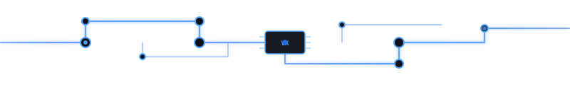

<!-- Neon Circuit hero — lightweight custom SVG -->

 

<pre>
╔══════════════════════════════════════════════════════════════════╗
║  <b>VINOD KUMAR NELANAKULA</b>  ·  node_id: nvinod007  ·  status: online  ║
╚══════════════════════════════════════════════════════════════════╝
</pre>

 

**Software Engineer · React Native · React · TypeScript**

📍 Hyderabad · Apr 2023 – Present · **3 years shipping production apps**

 

---

## ⚡ Signal Map — Projects

<pre>
                    ┌─────────────┐
                    │  <b>ExecLens</b>   │
                    │  ◉ shipped  │
                    └──────┬──────┘
                           │
         ┌─────────────────┼─────────────────┐
         │                 │                 │
  ┌──────▼──────┐   ┌──────▼──────┐   ┌──────▼──────┐
  │Sprint Poker │   │ DrawnGuess  │   │  CodeNest   │
  │ ◉ shipped   │   │ ◐ WIP       │   │ ◉ shipped   │
  └─────────────┘   └─────────────┘   └─────────────┘
</pre>

<table>
<tr>
<td width="25%" align="center" valign="top">

### 🟦 ExecLens

Step-by-step JS event loop visualizer.

> *Debugging async bugs made me wish I could **see** the event loop.*

</td>
<td width="25%" align="center" valign="top">

### 🟪 Sprint Poker

Zero-login planning poker — one link, no accounts.

> *Sprint planning kept breaking flow — built poker my team opens in one link.*

</td>
<td width="25%" align="center" valign="top">

### 🟩 DrawnGuess

Real-time multiplayer drawing — lobby live.

> *Learning real-time multiplayer + Canvas API — lobby first, gameplay next.*

</td>
<td width="25%" align="center" valign="top">

### 🟨 CodeNest

Nx monorepo — portfolio, apps, shared libs.

> *Tired of one-off repos — structured an Nx monorepo that scales together.*

</td>
</tr>
</table>

<pre align="center">
─────── trace: exec-lens ───▶ sprint-poker ───▶ drawnplay ───▶ code-nest ───────
</pre>

---

## 🔌 Production Bus — Enterprise Work

Software Engineer · enterprise HVAC / smart home · **90% test coverage** on Consumer Portal

<table>
<tr>
<td width="33%" valign="top">

**Consumer Portal**

React Native Web · SEO · deep linking

`coverage: 90%` · Jest

</td>
<td width="33%" valign="top">

**Support Portal**

React 18 · RTK Query · MongoDB geo · Redis · BullMQ

Full-stack production app

</td>
<td width="33%" valign="top">

**SmartHome RN**

Production mobile · TalkBack a11y · i18n · Wi‑Fi edge cases

React Native at scale

</td>
</tr>
</table>

---

## 🛠 Stack

 

---

## 📜 Certs · Education

**B.Tech CSE** · RGUKT IIIT RKV · CGPA **8.4**

 

<pre>
    ◉ ─── ◉ ─── ◉ ─── ◉ ─── ◉
         circuit closed · EOF
</pre>

